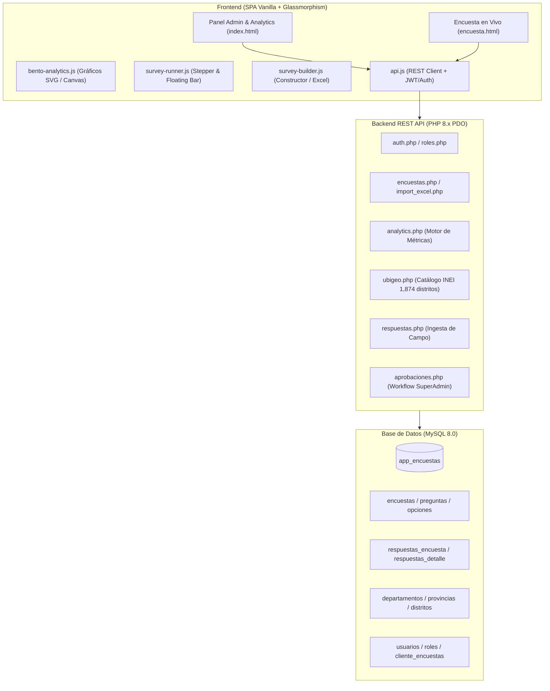

# SurveyD (OmniPoll) - Spatial Data Intelligence Core

[](LICENSE)
[](https://www.php.net/)
[](https://www.mysql.com/)
[](https://tailwindcss.com/)
[](docs/INSTALLATION.md)

**SurveyD** (desarrollado bajo el núcleo de inteligencia geoespacial *OmniPoll Spatial 3.0*) es una plataforma integral, moderna y de alto rendimiento para el **diseño, recolección en campo, gobernanza de aprobación y analítica telemetrizada** de encuestas y censos georreferenciados.

Diseñado bajo la estética **SondeoGlass Lumina**, ofrece una experiencia de usuario de nivel empresarial con soporte para modo claro/oscuro nativo, visualizaciones Bento adaptativas por tipo de pregunta, motor territorial INEI (25 Regiones, 196 Provincias, 1,874 Distritos) y aislamiento de seguridad por roles (RBAC Zero-Trust).

---

## 🌟 Características Principales

### 1. 📊 Bento Analytics con Visualizaciones Inteligentes por Tipo de Pregunta
El motor analítico evalúa automáticamente la naturaleza matemática de cada pregunta y selecciona la representación visual óptima:
- **Opción Única**: Gráfico **Donut SVG** interactivo con indicador central de % líder, cálculo trigonométrico de arcos y leyenda coloreada.
- **Opción Múltiple (Checkboxes)**: **Barras Horizontales de Frecuencia** con conteo de menciones y distinción de opción más votada.
- **Calificación (1 a 5 Estrellas)**: **Histograma Ponderado** con score de satisfacción promedio (`★ 4.3 / 5.0`) y distribución porcentual.
- **Escala NPS (0 a 10)**: Medidor oficial **Net Promoter Score** (-100 a +100) con segmentación cromática estándar: **Promotores (9-10, Verde)**, **Pasivos (7-8, Ámbar)** y **Detractores (0-6, Rosa)**.
- **Cascada Territorial (UBIGEO)**: **Ranking de Densidad Territorial** con geolocalización de distritos/regiones y barras de densidad.
- **Pregunta Abierta (Texto)**: **Tarjeta de Análisis Semántico** con termómetro de polaridad (Positivo / Neutro / Oportunidad de Mejora), hashtags temáticos y citas verbatim.

### 2. 🗺️ Motor de UBIGEO en Cascada (INEI Oficial Perú)
- Catálogo nacional precargado: **25 Departamentos**, **196 Provincias** y **1,874 Distritos**.
- Enlace dinámico e indexado: Selección instantánea sin recargas de página y con validación en servidor y cliente.

### 3. 📝 Constructor Visual & Importador Inteligente de Excel (.xlsx)
- Creador interactivo paso a paso con configuración de preguntas obligatorias, tipos de respuesta y categorías.
- Parser de Excel que procesa hojas de cálculo con alternativas separadas por comas o saltos de línea, generando automáticamente la estructura normalizada en base de datos.
- Generación de enlaces públicos de publicación y previsualización de código QR.

### 4. 📱 Experiencia Pública Minimalista y Mobile-First
- Interfaz limpia, tipografía clara (*Plus Jakarta Sans* y *JetBrains Mono*), y alto contraste visual.
- **Barra de Progreso Inteligente**: Transiciona fluidamente a una barra flotante inferior cuando el usuario hace scroll en smartphones para no perder la noción de avance.
- **Pantalla de Resumen y Confirmación**: Antes de registrar, el informante puede revisar todas sus respuestas y dispone de botones directos para **regresar y corregir** cualquier dato con un solo clic.

### 5. 🛡️ Gobernanza, Auditoría y Seguridad RBAC Multi-Inquilino
- **SuperAdmin**: Control total sobre el sistema, aprobación técnica de encuestas (`RES-DIR-XXX-2025/MTC`) y gestión de usuarios.
- **Analista**: Construcción, importación y visualización global de métricas.
- **Cliente**: Acceso restringido exclusivamente a las encuestas asignadas por el administrador, garantizando aislamiento de datos sensible y confidencialidad.

---

## 🏗️ Arquitectura del Sistema



---

## 📂 Estructura del Repositorio

```text
surveyd/
├── backend/
│   ├── api/
│   │   ├── analytics.php           # Motor de métricas y payload por tipo de gráfico
│   │   ├── aprobaciones.php        # Flujo de aprobación técnica y auditoría
│   │   ├── auth.php                # Autenticación, login y tokens de sesión
│   │   ├── encuestas.php           # CRUD de encuestas y estructura de preguntas
│   │   ├── import_excel.php        # Parser e importador de plantillas XLSX
│   │   ├── respuestas.php          # Recepción y registro de respuestas ciudadanas
│   │   ├── roles.php               # Consulta de roles RBAC
│   │   ├── ubigeo.php              # API de regiones, provincias y distritos INEI
│   │   └── usuarios.php            # Administración de usuarios y asignación a clientes
│   ├── config/
│   │   ├── db.php                  # Conexión Singleton PDO MySQL y variables de entorno
│   │   └── db_credentials.example.json  # Plantilla de credenciales
│   ├── database/
│   │   ├── schema.sql              # Esquema DDL normalizado
│   │   ├── ubigeo_completo.sql     # Script SQL con los 1,874 distritos de Perú
│   │   └── ubigeo_peru_completo.json # Dataset fuente INEI
│   ├── helpers/
│   │   ├── auth_helper.php         # Validación de permisos y asignaciones cliente
│   │   ├── repository.php          # Consultas reutilizables de base de datos
│   │   └── response.php            # Formateador JSON estandarizado y CORS
│   └── setup.php                   # Script automatizado de inicialización
├── frontend/
│   ├── css/
│   │   ├── animations.css          # Animaciones fluidas y transiciones cuánticas
│   │   ├── components.css          # Componentes SondeoGlass, botones y badges
│   │   └── theme.css               # Variables CSS, paletas claras/oscuras y tokens
│   ├── js/
│   │   ├── admin-approval.js       # Módulo de aprobación técnica SuperAdmin
│   │   ├── api.js                  # Cliente HTTP con fallback local inteligente
│   │   ├── app.js                  # Orquestador principal, navegación y gestión de usuarios
│   │   ├── bento-analytics.js      # Visualizaciones inteligentes SVG según pregunta
│   │   ├── public-survey.js        # Lógica de encuesta pública e integración
│   │   ├── survey-builder.js       # Constructor visual e importador Excel
│   │   └── survey-runner.js        # Stepper, barra flotante, UBIGEO y pantalla de resumen
│   ├── encuesta.html               # Vista pública para encuestados (optimizada móvil)
│   └── index.html                  # Panel administrativo y Bento Analytics
├── diseno/                         # Especificaciones de diseño, pantallas y mockups
├── docs/                           # Documentación técnica extendida
│   ├── API.md                      # Especificación de endpoints REST
│   ├── EXCEL_FORMAT.md             # Guía de importación de archivos Excel
│   └── INSTALLATION.md             # Guía paso a paso de instalación
├── .gitignore
├── LICENSE
└── README.md
```

---

## 🚀 Instalación Rápida

### Requisitos Previos
- Servidor Web (Apache / Nginx / XAMPP / WampServer)
- **PHP 8.0** o superior con extensiones `pdo`, `pdo_mysql`, `json`
- **MySQL 8.0** o MariaDB 10.4+

### Pasos de Instalación

1. **Clonar el repositorio:**
   ```bash
   git clone https://github.com/rllamoza/surveyd.git
   cd surveyd
   ```

2. **Configurar la Base de Datos:**
   - Copiar el archivo de credenciales de ejemplo:
     ```bash
     cp backend/config/db_credentials.example.json backend/config/db_credentials.json
     ```
   - Editar `backend/config/db_credentials.json` con los datos de su servidor MySQL:
     ```json
     {
       "host": "127.0.0.1",
       "port": 3306,
       "dbname": "app_encuestas",
       "user": "root",
       "password": "TU_PASSWORD"
     }
     ```

3. **Crear las Tablas y Cargar el Catálogo UBIGEO:**
   - Puede ejecutar el instalador automatizado en su navegador:
     ```
     http://localhost/surveyd/backend/setup.php
     ```
   - O importar manualmente los archivos SQL en MySQL:
     ```bash
     mysql -u root -p app_encuestas < backend/database/schema.sql
     mysql -u root -p app_encuestas < backend/database/ubigeo_completo.sql
     ```

4. **Acceder a la Plataforma:**
   - **Panel Administrativo & Bento Analytics:**
     `http://localhost/surveyd/frontend/index.html`
   - **Encuesta Pública (Ejemplo):**
     `http://localhost/surveyd/frontend/encuesta.html?id=CENSO001`

### 🔑 Credenciales por Defecto (Entorno de Pruebas)
| Rol | Correo Electrónico | Contraseña | Alcance de Permisos |
| :--- | :--- | :--- | :--- |
| **SuperAdmin** | `admin@omnipoll.pe` | `admin123` | Control total, aprobaciones oficiales y asignación de usuarios |
| **Analista** | `analista@omnipoll.pe` | `analista123` | Construcción de encuestas, importación y analítica global |
| **Cliente** | `cliente@empresa.pe` | `cliente123` | Solo lectura de reportes para encuestas explícitamente asignadas |

---

## 📊 Especificación de Formato Excel para Importación

Para crear encuestas a partir de archivos Excel, utilice una hoja de cálculo con las siguientes columnas:

| Columna | Descripción | Ejemplo |
| :--- | :--- | :--- |
| **Orden** | Número correlativo del paso | `1`, `2`, `3` |
| **Tipo** | Tipo de pregunta admitido | `opcion_unica`, `opcion_multiple`, `calificacion`, `escala_nps`, `ubigeo_cascada`, `texto` |
| **Enunciado** | Pregunta mostrada al encuestado | `¿Qué tipo de conexión principal utiliza en su domicilio?` |
| **Opciones** | Alternativas separadas por punto y coma `;` o saltos de línea | `Fibra Óptica (FTTH); Cable Coaxial; Móvil 4G/5G; Satelital` |
| **Obligatoria** | `SI` / `NO` | `SI` |

Consulte la [Guía Completa de Formato Excel](docs/EXCEL_FORMAT.md) para más detalles.

---

## 📖 Documentación Adicional

- [📘 Referencia Completa de la API REST](docs/API.md)
- [📗 Guía y Plantillas de Importación Excel](docs/EXCEL_FORMAT.md)
- [📙 Guía Detallada de Instalación y Despliegue](docs/INSTALLATION.md)

---

## 📄 Licencia

Este proyecto se encuentra bajo la Licencia **MIT**. Consulte el archivo [LICENSE](LICENSE) para más detalles.
